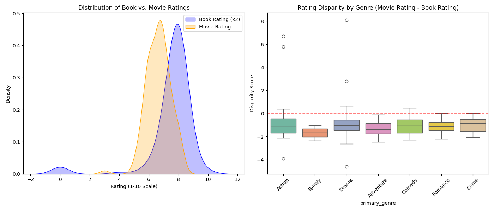

# Project Proposal: The "Book vs. Movie" Showdown: A Quantitative Analysis of Adaptations

## **Motivation**

This term project addresses the age-old cultural debate: "the book was better than the movie"—by applying data science methodologies to quantify and analyze the adaptation process. The primary goal is to mathematically determine if the quality of the source material dictates cinematic success and to explore how different narrative genres survive the transition from the page to the screen.

## **Data Sources and Collection Strategy**

To fulfill the requirement of working with a publicly available dataset and enriching it by another set of data, this project will utilize a two-step collection pipeline:

- **Base Data:** I will start with a public dataset of movies, such as the TMDB 5000 dataset from Kaggle. This will provide the foundational metrics, including movie ratings, genres, and financial data like budgets and box office returns.
- **Data Enrichment:** I will enrich this base data by pulling in literary metrics. Using Python, I will write a script to query the Google Books API (or scrape Goodreads data) based on the movie titles identified as adaptations. This will allow me to extract the original book's average user rating and total review count to append to the movie records.

### **Data Characteristics**

The resulting dataset will be a joined, relational set of matched book-movie pairs. While the base dataset contains thousands of entries, filtering strictly for adaptations and successfully matching them via the API will likely yield a refined dataset of roughly 500 to 1,000 complete samples. The data will feature a mix of continuous numerical variables (book ratings, movie ratings, production budgets) and categorical variables (genres).

### **Planned Analysis and Machine Learning Approach**

- **Data Analysis & Hypothesis Testing:** The initial analysis will compare the sample variance between book ratings and their corresponding movie adaptations. I will also run hypothesis tests to determine if the rating disparity during adaptation is statistically significant depending on the genre (e.g., determining if Sci-Fi adaptations fare better or worse than Romance adaptations).
- **Machine Learning:** For the predictive modeling phase, I will train a regression model to predict a movie's final rating based on a combination of its source material's rating, its production budget, and its genre classification.

## Data Collection & Enrichment

To analyze the rating disparity between books and their film adaptations, data was collected and merged from two publicly available sources:

1. **Base Dataset:** The [TMDB 5000 Movie Dataset](https://www.kaggle.com/datasets/tmdb/tmdb-movie-metadata), which provided movie titles, budgets, genres, and TMDB user ratings.
2. **Enrichment Dataset:** [The Goodreads Book Datasets 10M](https://www.kaggle.com/datasets/bahramjannesarr/goodreads-book-datasets-10m), which provided the original source material's rating.

A Python pipeline was built to filter TMDB for movies explicitly flagged as adaptations and join them with the Goodreads data via standardized string matching on the titles. The final enriched dataset consists of 124 matched book-movie pairs.

## Exploratory Data Analysis (EDA) & Hypothesis Testing

The Goodreads ratings (out of 5) were normalized to a 10-point scale to match the TMDB ratings. A `rating_disparity` metric was engineered by subtracting the normalized book rating from the movie rating (Negative = Book is better, Positive = Movie is better).

**Hypothesis Test 1: Paired T-Test (Overall Ratings)**

- **H0:** There is no significant difference between book and movie ratings.
- **H1:** There is a significant difference.
- **Result:** T-statistic: `5.9698`, P-value: `2.36e-08`. We strongly reject the null hypothesis. The data shows a statistically significant difference, with books scoring an average of 0.91 points higher than their movie adaptations.

**Hypothesis Test 2: One-Way ANOVA (Impact of Genre)**

- **H0:** Mean rating disparity is equal across all primary genres.
- **H1:** At least one genre has a significantly different mean disparity.
- **Result:** F-statistic: `0.8708`, P-value: `0.5191`. We fail to reject the null hypothesis. The primary genre of the story does not have a statistically significant impact on how well it translates to the screen.

